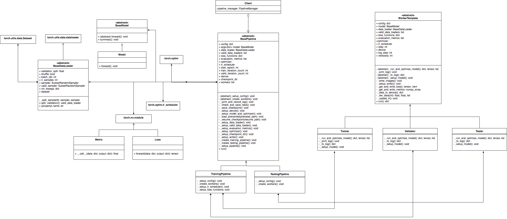

# Pytorch Golden Template

## Class Diagram


## Features

## Usage

Example: train a new model
```
python main.py -tc configs/template.json -sc configs/loss/cross_entropy.json
```

Example: resume from a checkpoint, inference and save outputs
```
python main.py --resume ./saved/ckpts/template_config+CrossEntropy/0723_180600/ckpt-ep1-valid_mnist_avg_loss0.2885-best.pth --mode test
```

Example: generate testing results
```
python main.py -sc configs/data/mnist_test.json --mode test -p <pretrained_weight>
```

Example: evaluate results
```
python main.py --mode eval -tc configs/template_test_config.json
```

## Folder Structure

## Authors
* Ya-Liang Chang (Allen) [amjltc295](https://github.com/amjltc295)
* Zhe Yu Liu [Nash2325138](https://github.com/Nash2325138)

