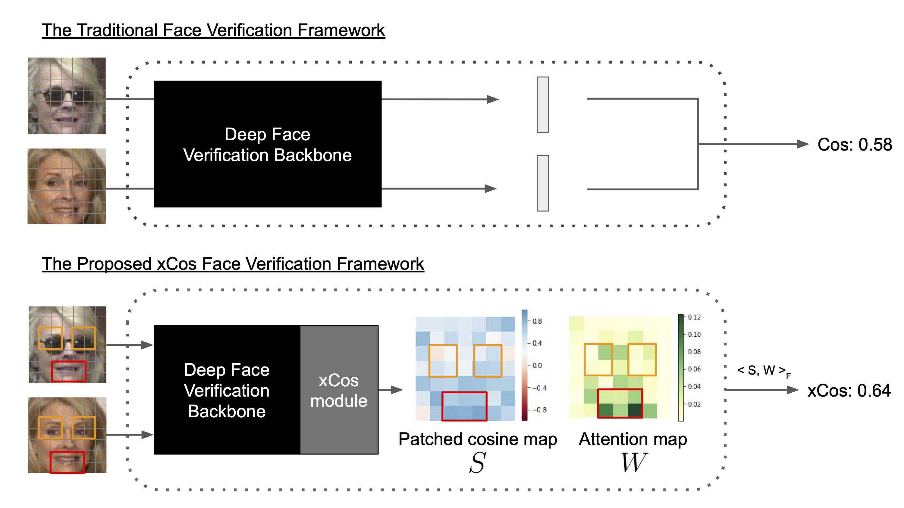
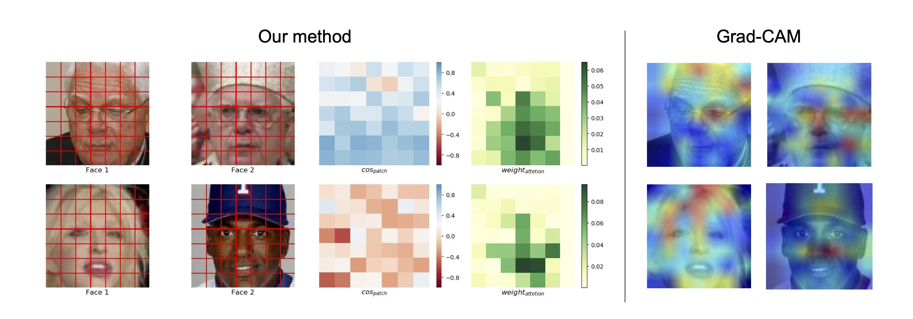
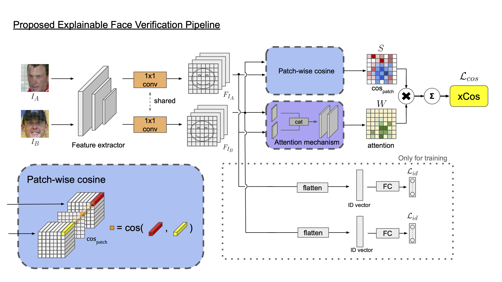

# xCos: An Explainable Cosine Metric for Face Verification Task

Official Pytorch implementation of "xCos: An Explainable Cosine Metric for Face Verification Task" [arXiv](https://arxiv.org/abs/2003.05383)


## Introduction
In "xCos: An Explainable Cosine Metric for Face Verification Task", we propose a novel similarity metric, called explainable cosine xCos, that comes with a learnable module that can be plugged into most of the verification models to provide meaningful explanations.

State-of-the-art face verification models extract deep features of a pair of face images and compute the cosine similarity or the L2-distance of the paired features. Two images are said to be from the same person if the similarity is larger than a threshold value. However, with this standard procedure, we can hardly interpret these high dimensional features with our knowledge.

Although there are some previous works attempting to visualize the results on the input images with saliency map, these saliency map based visualizations are mostly used for the localization of objects in a single image rather the similarity of two faces. Therefore, our framework provides a new verification branch to calculate similarity maps and discriminative location maps based on the features extracted from two faces. This way, we can strike a balance between verification accuracy and visual interpretability.


## Environment Setup/ Dataset preparation
### Environment Setup
```
git clone git@github.com:ntubiolin/xcos.git
cd xcos
conda env create -f environment_xcos_template.yml
source activate xcos_template
```
### Dataset preparation
The training dataset should be a folder structured like [torchvision.datasets.ImageFolder](https://pytorch.org/docs/stable/torchvision/datasets.html#imagefolder):
```
root/person_1/face_1.jpeg
root/person_1/face_2.png
root/person_2/face_1.jpg

root/person_n/face_1.png
root/person_n/face_2.png
root/person_n/face_m.png
```

The validation/ testing dataset we use are stored in a binary format. For customized validation/ testing dataset, you can write a customized dataset which read your own dataset and return the same format as the `__getitem__` method in `.src.data_loader.face_datasets.InsightFaceBinaryImg`, and then wrap the dataset with a new dataloader like the one in `.src.data_loader.data_loaders.FaceBinDataLoader`.

If you have no idea what the datasets you can use, [insightface](https://github.com/deepinsight/insightface) would be a good start.

## Training/ Testing
Please refer to the [pytorch-golden-template](https://github.com/amjltc295/pytorch-golden-template) for detailed config options.

Please execute `cd src/` first before executing the following codes.
### Training
Train the model from scratch:
```
python main.py -tc configs/xcos_train_config.json
```

### Testing
The pretrained weights can be accessed at [Google Drive](https://drive.google.com/file/d/1g5QnCATkoWZ1WXV1NZW6DbYqRPLx-ndo/view?usp=sharing). You can download it and place it under `../pretrained_model/xcos/`.
#### Quantitative testing
```
python main.py -tc configs/xcos_testing.json --mode test -p ../pretrained_model/xcos/20200217_accu_9931_Arcface.pth
```
#### Visualization
First, download and unzip [mtcnn_pytorch](https://drive.google.com/file/d/1d948kXxnc0RJv19v0ZK_zCqt7RpgXeis/view?usp=sharing) under `src/`. The `mtcnn_pytorch` module is used in the `src/visualize_xcos_one_example.ipynb`.

Second, please refer to `src/visualize_xcos_one_example.ipynb`. To get the visualization of xCos, you can replace the `img1` and `img2` image paths with the paths of the photos of your interest.

## License
**This repository is limited to research purpose.** For any commercial usage, please contact us.

## Authors
Yu-sheng Lin [ntubiolin](https://github.com/ntubiolin) biolin@cmlab.csie.ntu.edu.tw

Zhe-Yu Liu [Nash2325138](https://github.com/Nash2325138) zhe2325138@cmlab.csie.ntu.edu.tw

Yuan Chen

Yu-Siang Wang

Hsin-Ying Lee

Yirong Chen

Ya-Liang Chang (Allen) [amjltc295](https://github.com/amjltc295/) yaliangchang@cmlab.csie.ntu.edu.tw

[Winston H. Hsu](https://winstonhsu.info/) whsu@ntu.edu.tw

Please cite our papers if you use this repo in your research:
```
@article{Lin2020xCosAE,
  title={xCos: An Explainable Cosine Metric for Face Verification Task},
  author={Yu-sheng Lin and Zheyu Liu and Yuan Chen and Yu-Siang Wang and Hsin-Ying Lee and Yirong Chen and Ya-Liang Chang and Winston H. Hsu},
  journal={ArXiv},
  year={2020},
  volume={abs/2003.05383}
}
```
## Acknowledgement
This work was supported in part by the Ministry of Science and Technology, Taiwan, under Grant MOST 109-2634-F-002-032. We benefit from the NVIDIA grants and the DGX-1 AI Supercomputer and are also grateful to the National Center for High-performance Computing.