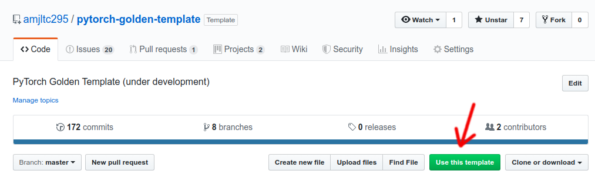

# Pytorch Golden Template

## Class Diagram


## Features

## Setup

1. Use the template by clicking the green button or directly clone this repo


2. Install miniconda/anaconda, a package for  package/environment management
```
wget repo.continuum.io/miniconda/Miniconda3-latest-Linux-x86_64.sh
bash Miniconda3-latest-Linux-x86_64.sh
```

3. Build conda environment from file
```
cd pytorch-golden-template
conda env create -f environment.yml
```

4. Update submodules
```
git submodule update --init --recursive
```

5. Activate the environment
```
source activate <environemnt name>
```

## Usage

```
usage: main.py [-h] [-tc TEMPLATE_CONFIG]
               [-sc SPECIFIED_CONFIGS [SPECIFIED_CONFIGS ...]] [-r RESUME]
               [-p PRETRAINED] [-d DEVICE] [--mode {train,test,eval}]
               [--saved_keys SAVED_KEYS [SAVED_KEYS ...]]
               [--ckpts_subdir CKPTS_SUBDIR] [--outputs_subdir OUTPUTS_SUBDIR]

PyTorch Template

optional arguments:
  -h, --help            show this help message and exit
  -tc TEMPLATE_CONFIG, --template_config TEMPLATE_CONFIG
                        Template configuraion file. It should contain all
                        default configuration and will be overwritten by
                        specified config.
  -sc SPECIFIED_CONFIGS [SPECIFIED_CONFIGS ...], --specified_configs SPECIFIED_CONFIGS [SPECIFIED_CONFIGS ...]
                        Specified configuraion files. They serve as experiemnt
                        controls and will overwrite template configs.
  -r RESUME, --resume RESUME
                        path to latest checkpoint (default: None)
  -p PRETRAINED, --pretrained PRETRAINED
                        path to pretrained checkpoint (default: None)
  -d DEVICE, --device DEVICE
                        indices of GPUs to enable (default: all)
  --mode {train,test,eval}
  --saved_keys SAVED_KEYS [SAVED_KEYS ...]
                        Specify the keys to save at testing mode.
  --ckpts_subdir CKPTS_SUBDIR
                        Subdir name for ckpts saving.
  --outputs_subdir OUTPUTS_SUBDIR
                        Subdir name for outputs saving.

```

Example: train a new model
```
python main.py
```

Example: train a new GAN model
```
python main.py -tc configs/template_GAN_train_config.json
```

Example: resume from a checkpoint, inference and save outputs
```
python main.py --resume ./saved/ckpts/template_config+CrossEntropy/0723_180600/ckpt-ep1-valid_mnist_avg_loss0.2885-best.pth --mode test
```

Example: generate testing results
```
# For submission to the leaderboard, etc.
python main.py --mode test -p <pretrained_weight>
```

Example: evaluate results
```
# You could evaluate results by other models (corresponding data loader needs to be defined)
# See the result_data_loaders in configs/template_eval_config.json for details
python main.py --mode eval
```

## Tensorboard Integration
By default, Tensorboard logs are recoded under saved/runs.

Please run ``` tensorboard --logidr saved/runs``` and go to `localhost:6006` to see the training progress on tensorboard.

## Folder Structure

## Authors
* Ya-Liang Chang (Allen) [amjltc295](https://github.com/amjltc295)
* Zhe Yu Liu [Nash2325138](https://github.com/Nash2325138)

